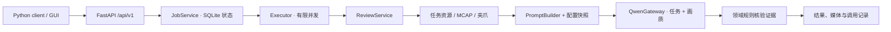

# Data Citadel

UMI-T 原子任务审核服务。FastAPI 提供版本化 HTTP API，Python SDK/CLI 和浏览器 GUI 通过 API 调试；当前数据集是抓取任务 98 条（开发集 68、留出集 30）。

## 启动

从本仓库运行，服务端支持 Linux。首次需要网络和 curl；uv 与 just 安装到项目的 `.tools/bin`，Python 环境使用 `.venv`，缓存使用 `.cache/uv`。

```bash
bash scripts/bootstrap.sh
export PATH="$PWD/.tools/bin:$PATH"
just dev
```

`just dev` 自动执行 `uv sync --locked`、启动 server、等待健康检查并打开 GUI。默认 GUI 为 <http://127.0.0.1:8770/>，接口文档为 <http://127.0.0.1:8770/docs>。Ctrl-C 关闭本次启动的服务。没有桌面时使用 `just dev --no-browser`。

已经装好工具时：

| 命令 | 用途 |
| --- | --- |
| `just setup` | 按 `uv.lock` 安装 Python 与依赖 |
| `just server` | 单独启动 API 服务并托管 GUI 静态文件 |
| `just client` | 打开已运行服务的 GUI |
| `just dev` | 一键安装环境、启动服务、打开 GUI |
| `just cli runs` | 用独立 HTTP client 查看注册实验 |
| `just test` | 单元、模型适配器、服务与 API 测试 |
| `just check` | 源码位置、Python 导入边界、Ruff 与 Git 空白检查 |
| `just test-gui` | 使用 Firefox/geckodriver 的浏览器联调，模型为假客户端 |

不设置 PATH 时，可以将上述 `just` 换成 `.tools/bin/just`。已搬移的旧虚拟环境可运行 `just setup --reinstall` 修复命令入口。添加依赖使用 `uv add 包名` / `uv add --dev 包名`，提交 `pyproject.toml` 和 `uv.lock`；日常启动不会自动更新锁文件。

其他配置目录使用 `CITADEL_CONFIG=/绝对路径 just dev`。单独连接远程服务使用 `just client --url http://主机:端口` 或 `just cli --url http://主机:端口 runs`。SSH 转发示例：

```bash
ssh -N -L 8770:127.0.0.1:8770 xuran-5090-7f
```

## 分层

工程约束以 [AGENTS.md](AGENTS.md) 为入口；业务需求见 [agent.md](agent.md)。
新增代码前按目录职责和依赖方向选择位置，交付前运行相关测试及 `just check`。

```text
config/
  server.toml           # 服务地址、队列并发、工作目录、注册数据集
  models.toml           # Qwen 模型、请求参数、超时与尝试次数
  benchmark.toml        # 评测数据集、输出目录、候选模型及价格快照
  tasks.json            # 每类任务的成功条件与坏例边界
  prompts/
    review_system.txt   # 任务审核 system prompt
    gripper.txt         # 夹爪和触觉辅助说明
    quality.txt         # 独立画质审核 system prompt
citadel/
  domain/               # 输入/输出模型、证据与判定规则、时序信号处理
  application/          # 审核用例、prompt 组装、实验评测、持久任务调度
  infrastructure/       # Qwen、任务资源、MCAP、文件/SQLite、线程执行器
  server/               # FastAPI 路由、公开数据结构、生命周期
  configuration.py      # 配置校验、不可变快照与版本
  bootstrap.py          # 实例创建与依赖注入
  __main__.py           # server 和本地数据清单准备入口
citadel_client/         # 仅依赖 HTTP 的 Python SDK 与 CLI
gui/                    # HTML/CSS 与浏览器 ES modules
scripts/                # 工具安装、开发启动、评测与报告、工程规则检查
tests/                  # 假模型测试及可选浏览器测试
justfile
pyproject.toml
uv.lock
.python-version
```

服务端路由调用应用用例；应用层通过注入的资源、媒体、模型与执行器能力工作。领域规则不依赖 HTTP、MCAP 或 Qwen SDK。配置文本由 `PromptBuilder` 组装为模型请求，`QwenGateway` 负责供应商协议，`ReviewPipeline` 负责两次调用和合并。所有具体依赖在 `bootstrap.py` 连接。



## 配置与检测流程

服务从 `config/server.toml` 读取数据集注册项，首次在新的 `artifacts/server/runs/实验名/` 生成只读源数据的清单。客户端提交注册的 `run_id` 和 `episode_id`，不能传服务器文件路径或 GT 字段。新增实验在 `[runs.新名字]` 设置 `dataset`，再重启服务。

1. 校验源数据与固定划分，按真实 `task_code` 获取指令、物体图和场景图。
2. 三路相机按真实时间对齐，每 1 秒采样并保留首尾，横向拼接。完整有序序列输入 Qwen。
3. 夹爪位置与指尖触觉保留原始时间戳，以 0.1 秒区间极值补充视频帧间的接触、松开和重夹。
4. 任务调用收到：任务 prompt、结构化任务规则/指令、参考图、夹爪辅助说明与时间数据、按时间排序的拼接 JPEG。图片使用 `image_url` 的 base64 data URL，每张候选图旁有帧号与真实时间。
5. 独立画质调用使用 `quality.txt` 和同一套三路时序帧；不接收任务参考图和夹爪信号。
6. 合并两次响应，校验帧号、主镜头覆盖、三路画质、悬空时长和各检查项。输出通过、不通过、待复核或处理失败，并保存时间证据。

这次重构保留原三份 prompt 文本、采样方法、动作边界和双调用流程。模型默认仍为 `qwen3.8-max-0902`、非思考模式，实测效果及已知误判见 [VALIDATION.md](VALIDATION.md)。本次工程测试不调用真实 Qwen，不能代替模型效果回归。

抓取成功要求基本抓取后受控悬空约 2 秒，末态仍悬空；允许自由位置、路径、角度、调整和换手。当前 0.2 秒容差仍是待校准参数。触觉没有单位标定，不能单凭力值证明悬空或失败；缺失信号不补零。

Qwen 凭据读取 `QWEN_API_KEY`、`DASHSCOPE_API_KEY` 或项目内 `Qwen-api/qwen_api_key.txt`；`QWEN_API_KEY_FILE` 可指定其他凭据文件。`QWEN_MODEL` 与 `QWEN_BASE_URL` 可覆盖模型配置。密钥不写入 Git、配置快照或请求记录。

每个提交保存 prompt 全文、任务规则、模型参数、采样与代码摘要。修改 prompt、任务规则或模型配置只影响新提交；已排队任务继续使用提交时的快照。改 Python 算法代码需要重启，避免版本记录与内存代码不一致。

## 调试与 API

GUI 提供实验/错例筛选、输入预览、后台任务进度、请求与响应记录、调用用量、历史结果比较。视频、夹爪曲线和证据帧保留时间联动。点击“输入预览 / 准备视频”只准备媒体与请求摘要，审核按钮才提交模型任务。刷新带 `job` 参数的页面会继续查询该任务。

| API | 行为 |
| --- | --- |
| `GET /api/v1/health`、`/runs` | 健康状态、注册实验 |
| `GET /api/v1/settings?run_id=grasp` | 当前 prompt 与有效配置快照 |
| `GET /api/v1/episodes?run_id=grasp&split=development` | 记录和评测状态 |
| `POST /api/v1/previews`、`/reviews` | 提交预览或审核，返回 HTTP 202 与任务 ID |
| `POST /api/v1/batches` | 用同一快照批量提交一个 split |
| `GET /api/v1/jobs/{job_id}`、`/{job_id}/output` | 任务状态、结果 |
| `GET /api/v1/results/{result_id}?run_id=grasp` | 历史结果 |
| `GET /api/v1/results/{result_id}/trace?run_id=grasp` | 脱敏请求、响应及失败尝试记录 |
| `GET /api/v1/episodes/{episode_id}/history?run_id=grasp` | 历史版本列表 |
| `GET /api/v1/episodes/{episode_id}/media?run_id=grasp` | 媒体与公开资源 URL |
| `GET /api/v1/reports?run_id=grasp&split=development` | 完整分母评测与已知 token 用量 |
| `POST /api/v1/runs/grasp/freeze` | 冻结开发结果并开放留出集 |

详细请求与响应结构以服务的 `/docs` 和 `/openapi.json` 为准。SDK 示例：

```python
from citadel_client import CitadelClient

with CitadelClient("http://127.0.0.1:8770") as client:
    episode = client.episodes("grasp")[0]["episode_id"]
    job = client.submit("grasp", episode, preview=True)
    finished = client.wait(job["job_id"])
    if finished["status"] == "succeeded":
        print(client.output(job["job_id"]))
```

CLI 支持 `preview 记录ID --wait`、`review 记录ID --wait`、`batch --limit 3`、`job 任务ID`、`output 任务ID`、`result 结果ID`、`report --split development`、`freeze`。例如 `just cli --run-id grasp report`，输出 JSON 可重定向到文件。失败后增加 `--retry-failed` 显式重试。

任务生命周期为 `queued → running → succeeded/failed`。“业务判定不通过”仍是执行成功，具体看结果的 `label`；模型、格式或证据错误属于执行失败。重复提交同实验、记录、任务类型和配置时复用任务；客户端等待超时不取消或重新提交。

## 并行与持久化

`server.toml` 的 `workers` 控制审核并发，`media_workers` 单独限制高内存 MCAP 解码，`max_pending` 限制排队加执行中的任务数。默认分别为 3、1、128。不同记录可并行，相同记录通过锁与持久化去重保护；队列不足时批量请求整批拒绝。

当前每个工作目录运行一个调度进程，使用 SQLite 保存状态、线程池执行任务。不要对同一工作目录启用多个 Uvicorn worker；第二个调度器会明确拒绝启动。未来替换执行器或任务存储时保留应用用例和 HTTP API。重启时恢复排队任务；执行中断任务标记失败并保留已有调用记录，检查后再显式重试，避免自动重复付费请求。

`artifacts/server/` 保存任务数据库；每个 run 下保存 `manifest.json`、`snapshots/`、`media/`、`resources/`、`calls/`、`results/` 和 `freeze.json`。结果与快照原子发布，不覆盖历史。模型请求记录中的图片仅保留摘要和长度。

GT 仅参与数据划分和结果评测，不进入模型输入。开发集全部处理且无执行错误后才能冻结；冻结配置或参考资源变化时不能继续使用该留出集。已看过的记录不能再宣称为新的独立测试集。

## 独立模型评测

`config/benchmark.toml` 指定只读 `dataset` 和新的 `output` 目录。路径相对本项目根目录解析，也接受绝对路径。
每轮使用 `artifacts/experiments/<实验名>/`；不引用旧服务实验，也不复制源码快照。

```bash
# 从原始数据准备清单、媒体和任务资源，冻结两类请求；不调用 Qwen
just benchmark prepare

# 发送真实 Qwen 请求；需单独配置凭据
just benchmark run

# 只读回执统计；不调用模型
just benchmark-report --work artifacts/experiments/model_benchmark
```

其他计划用 `just benchmark --plan config/其他评测.toml prepare` / `run`。
准备阶段需要可读的 MCAP、下载回执和任务标注，以及任务资源接口；媒体逐条处理，复用服务的解码、采样与夹爪处理。
完成资源获取后，缓存和请求摘要均归本轮实验所有：

```text
artifacts/experiments/<实验名>/
  source/               # manifest.json、media/、resources/；原始 MCAP 保留原位
  preparation.json      # 准备阶段固定的计划、代码、prompt、规则与价格
  inputs/               # 每条任务/画质请求的脱敏摘要与输入哈希
  experiment.json       # 准备完成后的不可变实验协议
  models/<模型>/
    calls/              # 每次请求及供应商响应/错误
    results/            # 最终结果和 started 标记
```

准备中断后可用相同计划继续，已完成输入须校验一致；修改数据、代码、prompt 或计划时使用新的输出目录。
`prepare` 与 `run` 共用目录锁，防止两个进程同时处理同一实验。运行前和每条调用前核验冻结协议及输入；
已有结果原样复用，存在 started 标记而没有最终结果时停止，先核查回执，避免自动重复付费。
审核仍使用共用 `ReviewPipeline` 的任务与画质两次调用，GT 仅在离线报告中关联。

旧 `input_run` 计划使用其记录的 Git 版本继续运行；新执行器不接管旧实验目录。
已保存的旧回执仍可用 `benchmark-report --work 原实验目录` 离线复算，已有报告不覆盖。

## 开发产物

`data_citadel` 是完整项目。`citadel/server/` 保存 HTTP 服务源码；项目内的运行产物按下表组织：

| 目录 | 内容 |
| --- | --- |
| `artifacts/server/` | 服务任务数据库、每个 run 的清单、媒体、资源、调用与审核结果 |
| `artifacts/experiments/<实验名>/` | 独立实验的输入缓存、冻结协议、调用回执与评测结果 |
| `artifacts/archive/<实验名>/` | 已结束且完成使用和引用核查的历史证据 |

文件位置和保留规则见 [AGENTS.md 的产物生命周期](AGENTS.md#产物生命周期)。
源码、复用脚本和测试写入正式代码目录并提交 Git；项目产物留在项目内部。
`just test`、`just test-gui` 分别使用 `.cache/tests/`、`.cache/gui-tests/`，再次运行时 pytest 会重建对应临时目录。
并行测试用 `just test --basetemp .cache/tests-独立名称` 指定不同目录。
本机 Snap 版 Firefox 无法使用 `/tmp` 工作树中的浏览器临时目录；需要 `just test-gui` 时，
将独立工作树放在用户主目录下可访问的位置，搬移环境后运行 `just setup --reinstall`。
测试代码使用 `tmp_path`，不要硬编码这些临时路径。新实验结果统一写入 `artifacts/experiments/<实验名>/`，
可复跑脚本放在 `scripts/` 并提交 Git。

`just check` 的规则检查器为 `scripts/check_rules.py`，仅使用 Python 标准库和 Git，失败时报告文件、行号及违规原因。
检查覆盖已跟踪和未被忽略的新 Python、JS/TS、HTML/CSS、Shell 源码的位置，以及 Python 静态导入边界。
忽略目录中的历史产物不参与扫描；动态加载和执行中的 I/O 仍由代码审查与相关测试验证。

原工作树的本地历史整理（2026-09-15）：

| 原位置 | 整理后位置 |
| --- | --- |
| 五轮 `artifacts/refactor_*tests/`、`artifacts/tests/`、`artifacts/gui-tests/` | `.cache/scratch/legacy-tests/<原名>/` |
| 一次性重构脚本与备份 `artifacts/refactor/` | `artifacts/archive/refactor/` |

以上为同一文件系统内搬移，逐目录校验文件内容和符号链接一致；迁移记录在 `.cache/scratch/artifacts-migration.json`。
旧审核窗口、当前 benchmark 和评测报告仍引用的模型实验保留原路径，后续完成退役再归档。

本轮整理在独立工作树的 `refactor/project-cleanup` 分支进行。环境、缓存与运行产物均在该工作树建立，
不复制旧 `artifacts/` 中的服务源码快照和实验缓存。原工作树继续运行现有评测；旧窗口及已保存结果仍按原版本读取，
待使用结束、引用核查通过后再归档。分支交付不包含合并、服务切换或旧实验目录删除。
